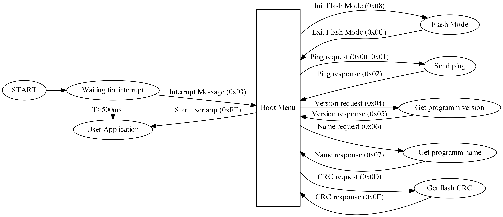
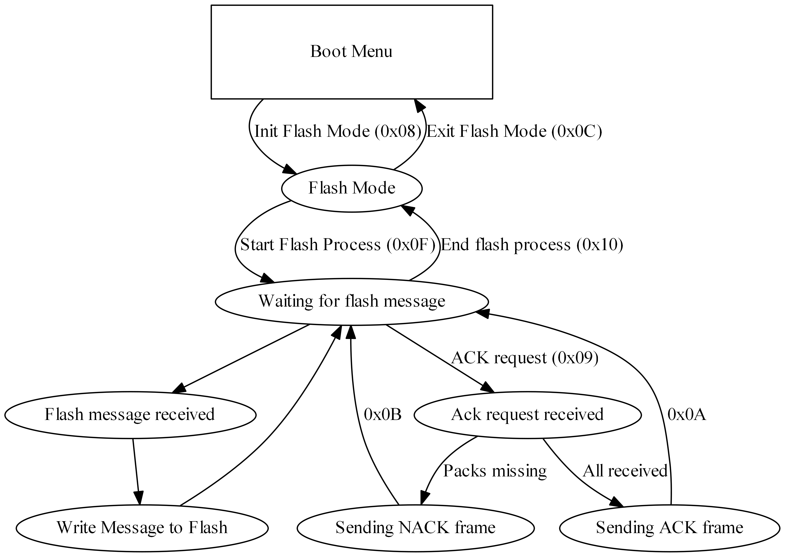

# CAN Interface Definition

This file defines the CAN bus communication between target and the CANnon bootloader.

###### Functionalities that need to be implementen in the bootloader:
* **[BL]** Running on startup, directly calling the user application
* **[CAN / BL]** Interrupting the current programm to start the bootloader
* **[BL]** Providing an EEPROM
* **[BL]** Storing a predefined target ID
* **[CAN / BL]** Responding to a CAN Ping broadcast
* **[CAN / BL]** Responding to a CAN Ping message
* **[CAN]** Setting the target ID
* **[CAN / BL]** Getting the current programm name and version
* **[CAN / BL]** Getting the current programm checksum
* **[CAN / BL]** Programming a new programm

##### Fancy future features
* Clone controller flash: Read flash from one device and write it to another
* Update Bootloader with bootloaded application

###### Required CAN messages:
* Broadcast Ping (a ping call everyone responds to)
* Single Ping (a ping call with an ID -> only the target with the id responds)
* Get program version
* Get program name
* Get EEPROM content
* Set EEPROM content
* Interrupt user application
* Send new program
* Get CRC of Flash
* Do CRC self check

### Message ID and Target ID
#### Target Device IDs
The IDs of the target devices will be stored in one byte. This limits the number of targets on a single bus to 256.  
The target device id will always be part of the CAN message id.

#### CAN ID composition
We will use CAN extended IDs to communicate between **CANnon** and **target device**

The 29bit extended identifier is split up into multiple sections to enable masking and filtering of messages:

* **[28]:** Flash Operation Flag (FOF)  
* **[27-20]:** Target Device ID  
* **If FOF == 1:**
 * **[19-0]:** Flash Pack ID  
* **If FOF == 0:**
 * **[19-12]:** Command ID

The target device ID is immutable per communication, meaning that the same target device id will be used not only for the request, but also for the response. The **CANnon** (Master) of the communication is responsible of handling the target ID.

#### Command IDs
|CMD ID |Command Name             |DLC|Message Content              |
|-------|-------------------------|---|-----------------------------|
| 0x00  |Single ping request      |  1|requester id                  
| 0x01  |Broadcast ping request   |  1|requester id                 
| 0x02  |Ping response            |  2|requester id / responder id  
| 0x03  |Interrupt startup        |  0|
| 0x04  |Get program version      |  0|
| 0x05  |Send programm version    |  8|version (64 LSB of commit id)
| 0x06  |Get program name         |  1|requester id                 
| 0x07  |Send program name        |  8|requester id / responder id / 1B packet id / 1B pack count / 4B string
| 0x08  |Init flash mode          |  0|
| 0x09  |ACK request              |  1|uint8: 1-64: Received packs
| 0x0A  |ACK                      |  0| -> All packs received
| 0x0B  |NACK                     |  8|64 Bit Received pack numbers
| 0x0C  |Exit flash Mode          |  0|
| 0x0D  |Get Flash CRC            |  0|
| 0x0E  |Send Flash CRC           |  2|2 Byte CRC checksum
| 0x0F  |Start flash process      |  8|Packs per Sprint (8 Bit) / Total Number of Packs (20 Bit)
| 0xFF  |Start user application   |  0|

#### Boot Menu

Starting from a reset, first the bootloader is started and waits up to 500ms for an incoming **Interrupt Message (0x03)**. If this message arrives, the target enters the bootloader menu and stays there unless told otherwise. The bootloader menu can be quit by sending the **Start user app (0xFF)** message. If no **Interrupt message (0x03)** is received within the timeout (500ms), the bootloader will jump to the **user application**.
In the boot menu, several actions are allowed:
* **Ping**: By sending a ping request (**0x00** for one device, specified by the Target Device ID; **0x01** for a broadcast ping), the target device is triggered to send a ping response (pong) on command id **0x02**. In order to enable pinging of different devices among themselves, the ID of the requesting device is sent as data. When answering, the target device appends its own ID to the data field so that ping responses are distinguishable when sending a ping broadcast.
* **Programm Version**: You can request the programm version of the software currently stored in the flash by sending **Version request (0x04)**. The device will answer with **Version response (0x05)**. The data contains the first 8 Byte of the committ ID of the software version. This feature relies on Git being the VCS of your choice.
* **Programm name**: TBD
* **CRC**: Sending **CRC request (0x0D)** will trigger the target device to send you the stored CRC checksum of the program currently stored in the flash. The resonse will be sent with **CRC response (0x0E)**
* **Flash mode**: To enter the flash mode, **Init flash mode (0x08)** has to be sent to a single device. Once in flash mode, commands to alter the flash storage can be sent. To exit the flash mode, send **Exit flash mode (0x0C)**

#### Flash mode
  

Once in flash mode, the flash process can be started by sending **Start flash process (0x0F)**. Only now the target device accepts flash packs. A flash pack is a CAN message whose extended ID starts with a 1 (see FOF). The following 8 Bit are (as always) the target device ID and the remaining 20 Bit contain the pack ID. Each message has its own (incrementally assigned) pack ID. By using 20 Bits for the pack ID, a maximum of 1048576 packs can be identified, which effectively limits the maximum programm size to approx. 8MB.  
The flash packs are grouped into sprints of (by default and maximum) 64 packs. Once the flash process has started, the **CANnon** sends out the first flash packs. When the current sprint is finnished, it sends an **ACK request (0x09)**. This signalizes the target device that all packs of the current sprint should have arrived by now. If this is the case, it sends an **ACK frame (0x0A)** with no further data attached. If not, a **NACK frame (0x0B)** is sent. The data of the NACK frame contains bitwise flags of the packs that didn't arrive at the target device (which is why 64 is the maximum sprint size). Like that, the **CANnon** knows which packs are missing on the target device. The missing packs are being resent and another **ACK request** is sent.  
When all packs have been sent, the flash process is quit by sending **End flash process (0x10)**.
It is strongly recommended to compare the CRC checksum of the flashed software with the one generated by the CANnon during the flash process.

### target
#### CRC
* CRC in software
* CRC in hardware (STM32)
* CRC in hardware with DMA (STM32)

Store CRC in EEPROM
Check Flash on request

### User Stories
* [x]1: Bootloader project can be flashed on STM32
* [x]2: Bootloader sends CAN message on startup
* [ ]3: Bootloader forwards to user application after time X
* [ ]4: Bootloader stops forwarding when CAN message is received
* [ ]5: Bootloader works with User Application in flash
* [ ]6: Bootloader accepts Flash Messages
* [ ]7: Bootloader stores transfered flash messages
* [ ]8: Bootloader calculates CRC checksum while flashing
* [ ]9: Bootloader sends back CRC checksum once done flashing
* [ ]more fancy stuff
